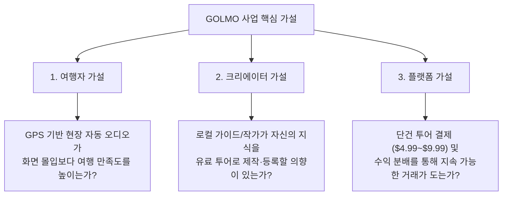
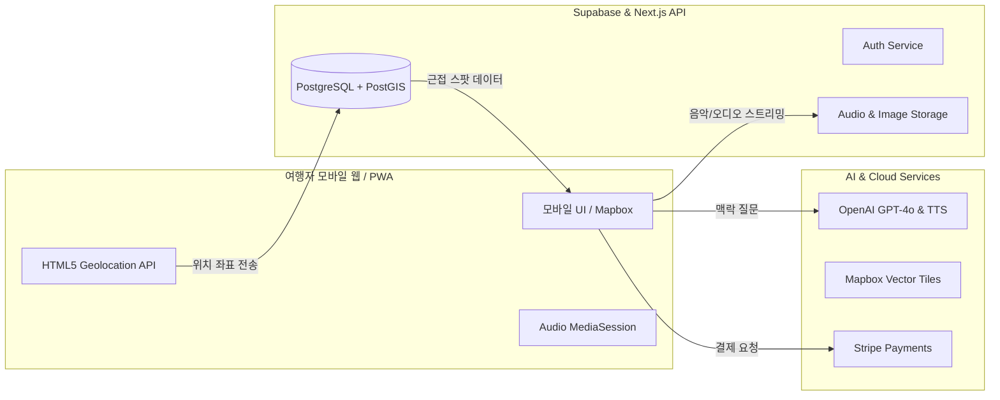
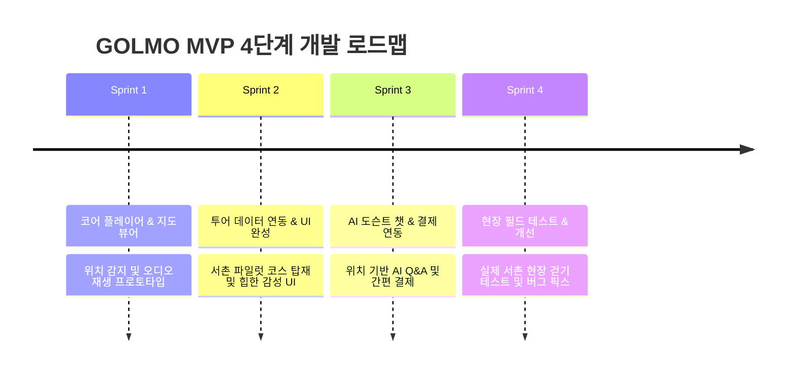

# [GOLMO] 사업 계획서 및 MVP 개발 실행 명세서 (Execution Spec)

> **"Get Lost. Find Your Story. (길을 잃으면 여행이 시작된다)"**  
> GPS 기반 AI 여행 가이드이자, 현지 크리에이터의 골목 이야기를 세계 여행자에게 연결하는 글로벌 여행 콘텐츠 플랫폼

---

## 목차
1. [사업 개요 및 브랜드 아이덴티티](#1-사업-개요-및-브랜드-아이덴티티)
2. [문제 정의 및 타깃 고객 페르소나](#2-문제-정의-및-타깃-고객-페르소나)
3. [핵심 가설 및 검증 프레임워크](#3-핵심-가설-및-검증-프레임워크)
4. [MVP 핵심 기능 명세 (Core Features)](#4-mvp-핵심-기능-명세-core-features)
5. [기술 아키텍처 및 권장 기술 스택](#5-기술-아키텍처-및-권장-기술-스택)
6. [데이터베이스 설계 (ERD / Schema)](#6-데이터베이스-설계-erd--schema)
7. [비즈니스 모델(BM) 및 정산 체계](#7-비즈니스-모델bm-및-정산-체계)
8. [초기 파일럿 콘텐츠 기획 (서울 시범 지역)](#8-초기-파일럿-콘텐츠-기획-서울-시범-지역)
9. [바이브 코딩(Vibe Coding) MVP 단계별 개발 로드맵](#9-바이브-코딩vibe-coding-mvp-단계별-개발-로드맵)
10. [핵심 성공 지표(KPI) 및 향후 확장 계획](#10-핵심-성공-지표kpi-및-향후-확장-계획)

---

## 1. 사업 개요 및 브랜드 아이덴티티

### 1-1. 서비스 정의
**GOLMO**는 여행자가 현재 서 있는 위치(GPS)를 기반으로 주변의 숨겨진 장소와 이야기를 발견하고, 현지 크리에이터가 직접 기획하고 녹음(혹은 AI 보이스 생성)한 오디오 투어를 들으며 자유롭게 탐험하는 여행 플랫폼입니다.
- **기존 여행 앱과의 차별점**: 기존 앱이 '유명 랜드마크 A에서 B로 가는 최단 경로와 맛집 평점'을 제공한다면, GOLMO는 **'목적지와 목적지 사이의 골목길에서 마주치는 장소의 역사, 사람들의 삶, 숨겨진 스토리'**에 집중합니다.

### 1-2. 브랜드 아이덴티티 매트릭스
| 구분 | 내용 |
| :--- | :--- |
| **브랜드명** | **GOLMO** |
| **슬로건 (글로벌)** | **Get Lost. Find Your Story.** |
| **슬로건 (국문)** | **길을 잃으면 여행이 시작된다.** |
| **어원** | 한국어 **‘골목(GOLMOK)’**에서 영감을 받아 글로벌 발음과 기억이 쉽도록 'K'를 덜어낸 명칭 |
| **핵심 가치** | **우연한 발견(Serendipity)**, **현지의 시선(Local Authenticity)**, **여행자의 자유(True Autonomy)** |
| **서비스 형태** | 1단계: 모바일 웹 / PWA (앱 설치 장벽 제거) → 2단계: 크로스플랫폼 네이티브 앱 (React Native / Flutter) |
| **초기 타깃 시장** | 서울을 방문하는 **글로벌 영어권 FIT(개별 자유 여행자)** |
| **장기 비전** | 전 세계 도시 골목마다 현지 크리에이터의 스토리가 채워지는 **글로벌 오디오 투어 마켓플레이스** |

---

## 2. 문제 정의 및 타깃 고객 페르소나

### 2-1. 시장의 문제점 (Pain Points)
1. **여행자(Traveler)**
   - 대형 버스 패키지 투어나 고정된 가이드 투어는 이동이 수동적이고 일정에 얽매임.
   - 포털 검색(블로그, 인스타)은 광고성 정보가 범람하며, 현장에서 스마트폰 화면만 쳐다보게 됨.
   - 깊이 있는 현지 문화를 느끼고 싶지만 언어 장벽과 정보 부족으로 그냥 스쳐 지나감.
2. **현지 크리에이터(Creator: 로컬 가이드, 스토리텔러, 문화해설사, 인플루언서)**
   - 오프라인 1:1 투어는 시간과 체력의 한계(Scale 불가)로 소득 확장이 어려움.
   - 유튜브/인스타는 조회수 수익 외에 직접적인 콘텐츠 유료화 통로가 부족함.

### 2-2. 핵심 페르소나
- **타깃 여행자 (Alex, 28세 미국인 여행자)**
  - 특성: 나홀로 서울 여행 중. 뻔한 관광지(명동 쇼핑 등)보다 서촌, 을지로, 삼청동의 고즈넉한 골목과 카페 문화를 좋아함.
  - 니즈: 골목을 걸으며 에어팟을 꽂고 있으면, 주변의 흥미로운 얽힌 사연이 자동으로 흘러나와 산책하듯 여행하고 싶음.
- **타깃 크리에이터 (민지, 32세 서촌 거주 문화기획자)**
  - 특성: 동네의 골목 역사, 오래된 한옥의 비하인드 스토리, 단골 바 이야기를 꿰고 있음.
  - 니즈: 자신의 지식을 투어 코스로 엮어 판매하고, 매번 동행하지 않아도 지속적인 패시브 인컴(Passive Income)을 창출하고 싶음.

---

## 3. 핵심 가설 및 검증 프레임워크

### 3-1. 3대 핵심 가설


### 3-2. MVP 검증 목표
- ❌ **목표가 아닌 것**: 수만 명의 가입자, 서울 전역 1,000개 장소 등록
- ⭕ **진짜 목표**: **"특정 골목(예: 서촌 1개 코스)에서 외국인 여행자가 유료 결제($4.99)를 진행하고, 현장에서 코스를 끝까지 완주(완주율 70% 이상)하며 긍정적인 평점을 남기는가?"**

---

## 4. MVP 핵심 기능 명세 (Core Features)

MVP 단계에서는 개발 범위를 극단적으로 압축하여 **핵심 여행 경험(Core Loop)**에만 집중합니다.

### 4-1. 여행자 모드 (Traveler Client)
1. **위치 기반 자동 트리거 (GPS Geofencing Audio)**
   - 백그라운드/웹 위치 트래킹을 통해 특정 스팟(반경 20~30m) 진입 시 오디오 자동 재생 또는 푸시 알림.
   - 수동 재생 지원 (GPS 오차 대비 탭 재생 가능).
2. **미니멀 인터랙티브 지도 (Interactive Map)**
   - 현재 내 위치, 투어 경로(폴리라인), 스토리 스팟(핀) 표시.
   - 복잡한 정보 배제, 산책에 방해되지 않는 다크/미니멀 스타일 지도.
3. **스마트 팟캐스트 플레이어 (Audio Player)**
   - 배경 재생 지원 (Media Session API), 재생 속도(1x, 1.2x), 스크립트(자막) 보기.
4. **AI 로컬 도슨트 챗봇 ("Ask GOLMO")**
   - 현재 위치 및 보고 있는 장소 기반 Q&A ("이 건물은 왜 지붕이 저렇게 생겼어?", "이 근처에서 지금 혼자 갈 만한 카페 추천해줘").
   - OpenAI GPT-4o-mini 기반 프롬프트 튜닝.
5. **간편 결제 & 다국어 지원**
   - Stripe / 글로벌 카드 결제 (MVP 시 데모 모드 또는 단건 결제 지원).
   - 기본 인터페이스: 영어 (초기 타깃), 콘텐츠 영문 지원.

### 4-2. 크리에이터 및 어드민 도구 (MVP 1단계는 경량화 어드민)
1. **스튜디오/에디터 (경량 웹 어드민)**
   - 지도 위 클릭으로 스팟(Stop) 핀 찍기 및 Geofence 반경 설정.
   - 스팟별 오디오 파일(MP3) 업로드 및 스크립트/사진 입력.
   - AI 음성 변환(TTS - ElevenLabs/OpenAI Audio) 옵션: 대본만 입력해도 자연스러운 영어 음성 투어 생성.

---

## 5. 기술 아키텍처 및 권장 기술 스택

### 5-1. 기술 스택 선정 (바이브 코딩 및 빠른 출시 최적화)
| 레이어 | 기술 스택 | 선정 이유 |
| :--- | :--- | :--- |
| **Frontend** | **Next.js 14+ (App Router)** or **Vite + React** | 빠른 로딩, SEO, 모바일 반응형 완벽 지원 |
| **PWA / Mobile** | **PWA (next-pwa)** | 앱스토어 심사 없이 URL 접속으로 즉시 실행, 홈 화면 추가 |
| **Styling** | **Vanilla CSS / TailwindCSS + Radix UI** | 미려하고 현대적인 힙한 다크 테마/글래스모피즘 구현 |
| **Map & GPS** | **Mapbox GL JS** or **Leaflet** | 글로벌 여행자 친화적 지도(영문 지원), 부드러운 위치 핀 트래킹 |
| **Backend / DB** | **Supabase (PostgreSQL + PostGIS)** | 위치 쿼리(거리 계산) 지원, Auth, Storage, 빠른 백엔드 구축 |
| **AI Engine** | **OpenAI API (GPT-4o-mini, TTS/Whisper)** | 로컬 챗봇 도슨트 및 다국어 오디오 생성 |
| **Hosting** | **Vercel** | CI/CD 자동화 및 엣지 배포 |

### 5-2. 서비스 아키텍처 다이어그램


---

## 6. 데이터베이스 설계 (ERD / Schema)

### 6-1. 핵심 엔티티 구성
1. **users**: 여행자 및 크리에이터 계정
2. **tours**: 투어 코스 기본 정보 (제목, 설명, 지역, 가격, 썸네일)
3. **stops (waypoints)**: 투어 내 각 정류장/골목 지점 (위도, 경도, 트리거 반경, 순서)
4. **contents**: 각 스팟의 스토리 (오디오 URL, 스크립트 텍스트, 팁 사진)
5. **purchases**: 투어 구매 내역
6. **user_progress**: 여행자의 현재 투어 진행 상태 (완료된 스팟, 재생 이력)

### 6-2. 스키마 정의 (PostgreSQL / Supabase DDL)

```sql
-- 1. 프로필 테이블
CREATE TABLE profiles (
  id UUID REFERENCES auth.users PRIMARY KEY,
  email TEXT NOT NULL,
  full_name TEXT,
  role TEXT DEFAULT 'traveler' CHECK (role IN ('traveler', 'creator', 'admin')),
  created_at TIMESTAMPTZ DEFAULT NOW()
);

-- 2. 투어 테이블
CREATE TABLE tours (
  id UUID PRIMARY KEY DEFAULT gen_random_uuid(),
  creator_id UUID REFERENCES profiles(id),
  title TEXT NOT NULL,
  slug TEXT UNIQUE NOT NULL,
  tagline TEXT,
  description TEXT,
  city TEXT DEFAULT 'Seoul',
  district TEXT, -- 예: 'Seochon', 'Euljiro'
  estimated_duration_min INT DEFAULT 90,
  distance_km NUMERIC(3,1) DEFAULT 2.5,
  price_usd NUMERIC(6,2) DEFAULT 4.99,
  cover_image_url TEXT,
  is_published BOOLEAN DEFAULT false,
  created_at TIMESTAMPTZ DEFAULT NOW()
);

-- 3. 스팟(Stop / 골목 지점) 테이블
CREATE TABLE stops (
  id UUID PRIMARY KEY DEFAULT gen_random_uuid(),
  tour_id UUID REFERENCES tours(id) ON DELETE CASCADE,
  order_index INT NOT NULL,
  title TEXT NOT NULL,
  description TEXT,
  latitude DOUBLE PRECISION NOT NULL,
  longitude DOUBLE PRECISION NOT NULL,
  radius_meters INT DEFAULT 25, -- 지오펜싱 인식 반경
  audio_url TEXT NOT NULL,
  audio_duration_sec INT,
  transcript TEXT,
  image_urls TEXT[],
  created_at TIMESTAMPTZ DEFAULT NOW()
);

-- 4. 구매 내역 테이블
CREATE TABLE purchases (
  id UUID PRIMARY KEY DEFAULT gen_random_uuid(),
  user_id UUID REFERENCES profiles(id),
  tour_id UUID REFERENCES tours(id),
  amount_usd NUMERIC(6,2) NOT NULL,
  status TEXT DEFAULT 'completed',
  created_at TIMESTAMPTZ DEFAULT NOW()
);

-- 5. 투어 진행 상태 (완주율 트래킹)
CREATE TABLE user_progress (
  id UUID PRIMARY KEY DEFAULT gen_random_uuid(),
  user_id UUID REFERENCES profiles(id),
  tour_id UUID REFERENCES tours(id),
  last_stop_id UUID REFERENCES stops(id),
  completed_stops UUID[] DEFAULT ARRAY[]::UUID[],
  is_completed BOOLEAN DEFAULT false,
  updated_at TIMESTAMPTZ DEFAULT NOW()
);
```

---

## 7. 비즈니스 모델(BM) 및 정산 체계

### 7-1. 수익 모델 (Monetization)
1. **단건 투어 결제 (Pay-per-Tour)**:
   - 가격대: 코스당 **$4.99 ~ $9.99** (약 6,500원 ~ 13,000원)
   - 커피 한두 잔 가격으로 현지 가이드와 동행하는 가치 제공.
2. **크리에이터 수익 배분 (Revenue Share)**:
   - 초기 플랫폼 활성화 기간: **크리에이터 70% : 플랫폼 30%** (결제 수수료 제외 후)
3. **추후 확장 모델**:
   - 지역 골목 상점/카페와의 제휴 바우처 (투어 완주 시 골목 카페 10% 할인 쿠폰 제공).
   - All-Access 서울 골목 패스 ($19.99에 서울 5개 코스 무제한 이용).

---

## 8. 초기 파일럿 콘텐츠 기획 (서울 시범 지역)

초기 MVP 런칭 시 등록할 **검증용 파일럿 코스 1개**를 정밀하게 구성합니다.

### 📍 파일럿 코스 1: "서촌의 숨겨진 시간 (Seochon: Whispering Alleys)"
- **타깃 소요 시간**: 약 70분 (도보 1.8km, 총 6개 스팟)
- **콘텐츠 언어**: 영어 (현지인의 따뜻하고 감성적인 보이스톤)
- **스팟 구성 예시**:
  1. **Spot 1. 경복궁 영추문 앞**: 현대와 조선의 경계에서 골목 탐험 시작 선언.
  2. **Spot 2. 이상의 집 (House of Yi Sang)**: 천재 시인이 뛰놀던 골목과 모던 다방 문화.
  3. **Spot 3. 통인시장 뒷골목 효자베이커리 골목**: 50년 단골들의 온기가 남은 골목길 이야기.
  4. **Spot 4. 누하동 한옥 골목길**: 관광객이 모르는 진짜 사람들이 거주하는 한옥 골목의 고요함.
  5. **Spot 5. 수성동 계곡 진입로**: 인왕산 아래 조선 화가 정선이 그림을 그리던 계곡 소리.
  6. **Spot 6. 보안여관 & 북카페**: 예술가들이 묵던 여관에서 현재 복합문화공간이 되기까지의 스토리.

---

## 9. 바이브 코딩(Vibe Coding) MVP 단계별 개발 로드맵

AI 어시스턴트와 함께 빠르고 유기적으로 프로토타입을 빌드할 수 있도록 **4단계(Sprint)**로 세분화합니다.



### [Sprint 1] 코어 플레이어 & 위치 감지 엔진 (Day 1~3)
- [x] 프론트엔드 프로젝트 셋업 (Vite/Next.js + Vanilla CSS / Tailwind)
- [ ] Mapbox GL 지도를 띄우고 사용자의 현재 GPS 실시간 마커 표시
- [ ] 가상 위치 시뮬레이터(디버깅용) 구현 (클릭한 지점으로 내 위치 이동)
- [ ] 지정된 스팟 20m 이내 진입 시 오디오 팝업 & 재생 기능 구현

### [Sprint 2] 서촌 파일럿 코스 데이터 연동 & 다크 테마 UI (Day 4~6)
- [ ] GOLMO 브랜드 아이덴티티 반영 (세련된 다크 테마, 골목 감성 타이포그래피)
- [ ] 서촌 6개 스팟 데이터(좌표, 오디오, 텍스트, 이미지) 로컬/Supabase 연동
- [ ] 투어 상세 페이지, 스팟 리스트, 백그라운드 오디오 플레이어 UI 완성

### [Sprint 3] AI 가이드 도슨트 & 간편 인증/결제 (Day 7~9)
- [ ] "Ask GOLMO" AI 챗봇 팝업 컴포넌트 개발 (OpenAI API 연동)
  - 사용자의 현재 스팟 정보를 시스템 프롬프트에 주입하여 현장 맞춤형 답변 제공
- [ ] 투어 언락(Unlock) 결제 흐름 (Stripe 테스트 모드 또는 간이 결제)

### [Sprint 4] 현장 필드 테스트 및 PWA 패키징 (Day 10~12)
- [ ] PWA 매니페스트 및 서비스 워커 등록 (스마트폰 브라우저에서 '홈 화면에 추가')
- [ ] 실제 서촌 현장에서 스마트폰 들고 걷기 테스트 (GPS 수신율, 배터리 소모량 점검)
- [ ] 외국인 친구 또는 게스트하우스 숙박객 3~5명 대상 게릴라 테스트 진행

---

## 10. 핵심 성공 지표(KPI) 및 향후 확장 계획

### 10-1. 초기 검증 핵심 지표 (North Star Metric)
- **북극성 지표**: **투어 완주율 (Tour Completion Rate)**
  - 구매 여행자 중 마지막 스팟까지 오디오를 청취한 비율이 **60% 이상**인가?
- **보조 지표**:
  - 1인당 AI 도슨트 질문 수 (평균 2회 이상 시 몰입도 높은 것으로 판단)
  - 투어 종료 후 평점 (5점 만점 중 4.5점 이상)
  - 소셜/입소문 공유 의향 (NPS 50 이상)

### 10-2. 차기 확장 단계 (Post-MVP)
1. **크리에이터 셀프 등록 스튜디오 오픈**: 누구나 지도 위에서 자신만의 투어를 만들고 심사 후 출시하는 오픈 마켓화.
2. **AI 음성 복제(Voice Cloning)**: 크리에이터가 10분만 녹음하면 다국어(영어, 일본어, 중국어)로 자동 번역 및 본인 목소리로 투어 제공.
3. **글로벌 도시 확장**: 교토, 타이베이, 방콕, 파리 등 골목 문화가 발달한 세계 주요 도시로 동일 프레임워크 확장.

---
*문서 작성일: 2026-09-25*  
*프로젝트: GOLMO (Get Lost. Find Your Story.)*
